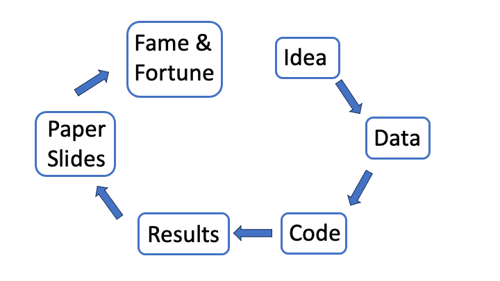
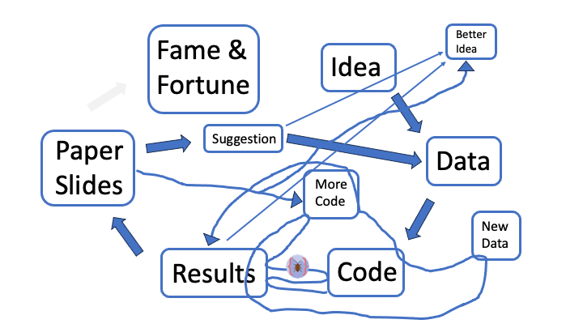
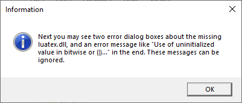
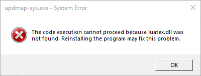
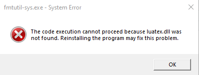
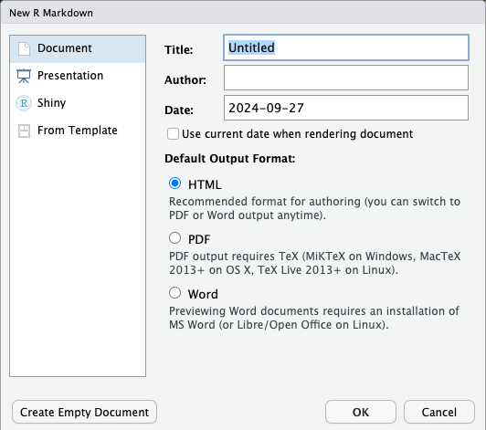
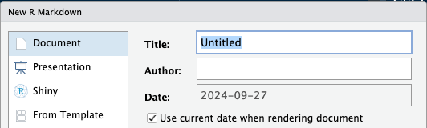

```{r setup, include=FALSE}
library(knitr)
library(emoji)
options(htmltools.dir.version = FALSE)
knitr::opts_chunk$set(tidy=TRUE, prompt=FALSE, error=TRUE)
```


# Work Flow

.center[]


---
# Work Flow in the Real World

.center[]


---
background-image: url("img/baton.jpg")
background-color: black

<p style="color:red; font-weight:bold; font-size:40px; text-align: center">
"THIS IS NOT YOUR RACE!"<br>-- <code>R Markdown</code></p>


---
class: slide-font-25
# Motivation

* Let's use a *single* document to weave empirical results into our substantive text

--

  - reduce the number of steps to create the final document and efficiently
  reproduce those steps

--

  - create paper/project reports on what you have done and *why*
      + why didn't I use a log transformation?
      + do the results change much if education is included in the model?
      + useful reference when writing the "final" version

--

* You can also include the actual code that produces your results

  - show others (future you, coathors, students, advisors)
  exactly what you have done


---
# Motivation (cont.)

* Versatility with a single program

  - use different programs (e.g., Stata, Python)
  
  - create different types of output (PDF, Word, webpage) with one-click publishing
  
  - include web/document links, references, equations, HTML

--

* (un-motivation) But do I *really* want to write my paper in R Studio?!?

  - my co-authors love track changes!
  
  - Word makes it so easy to add comments


---
# Outline 

* **Setup** -- software & installation

* **Getting Started** with R Markdown files (file_name.Rmd)
  + YAML header (set title info, format, and options)
  + Basic markdown syntax
  + Including code/results (inline & chunks)
  
* **Examples**

* **Advanced Features**


---
class: wide-slide

.pull-left2[]
--
.pull-right2[
**A separate (IDE) program that makes** <br> **R-life easier**
  * file templates, code completion, syntax highlighting, smart indentation
  * one-click publication
]


---
class: wide-slide

.pull-left2[]

.pull-right2[
**A separate (IDE) program that makes** <br> **R-life easier**
  * file templates, code completion, syntax highlighting, smart indentation
  * one-click publication

**Additional packages & software**
  * [https://pandoc.org/](https://pandoc.org/) free software that translates
  between formats (ships with R Studio)
  * R packages
    - `knitr`: weave code into substantive text
    - `rmarkdown`: translates markdown (+ code & results) into pdf/html/word/powerpoint
    - `tinytex`: install small version of $\LaTeX$
]


---
## Installation

* Mac users will install **X Quartz** program from [https://www.xquartz.org/](https://www.xquartz.org/), which is used by Mac to show plots

* Open R Studio, then copy and paste the following command into the **Console** pane.  
 
  ```{r install, eval=FALSE, include=TRUE, echo=TRUE}
  install.packages(c("rmarkdown", "tinytex", "rprojroot", "Rcpp"),
                   repos = "http://cran.r-project.org")
  ```

*Note*: this assumes you do not have $\LaTeX$ installed on your computer
(needed to create PDF files with R Markdown).


---
## R Packages (cont.)

* Install a small version of LaTeX (using the tinytex package).  This will take a few minutes...
  
* Windows users may see a warning about needing to install the Rtools program, and 2 warnings complaining about missing files associated with `luatex.dll`

  - but these can all be ignored.

  ```{r tinytex, eval=FALSE, include=TRUE, echo=TRUE}
  tinytex::install_tinytex()
  ```


---
## R Packages (cont.)

* If you would like to test your `tinytex` installation, close R Studio, then re-open it and run the following command

  ```{r is_tinytex, eval=FALSE, include=TRUE, echo=TRUE}
  tinytex:::is_tinytex()  ## should return TRUE
  ```

* Note the 3 colons after `tinytex`.   If the above command returns a value of `TRUE`, then you are all set.


---
## Warning Messages

* Here are 3 screenshots of the informational and (2) warning messages that Windows users can safely ignore.

<br/><br/>

.center[]


---
## Warning Messages 1

(can safely ignore)

<br/><br/>

.center[]


---
## Warning Messages 2

(can safely ignore)

<br/><br/>

.center[]


---
class: wide-slide, slide-font-25
## Getting started

.pull-left[

* In R Studio, `File` &rarr; `New File` &rarr; `R Markdown...`
<br> (file names have an .Rmd extension: `file_name.Rmd`)

  + A new window will pop up asking what type of document (regular doc,
  presentation, etc) and format you want (pdf, Word, HTML)
  + You can also include title info

* For this example, we'll go with Document & PDF (since I have `tinytex`
installed)
]

.pull-right[]


---
# Getting started - template

The .Rmd template file includes 3 types of input

--

1. YAML -- first 5 lines

  + title info, options for producing output
  
--

1. Code -- chunks and in-line code

  + run R code and produce output
  
--

1. Regular text with markdown syntax for formatting

  + text for humans with formatting to improve exposition


---
# YAML ain't markup language!

YAML blocks appear at the top of the document and are fenced in with 3 dashes

```{yaml}
---
title: "Untitled"
output: pdf_document
date: "2024-09-27"
---
```

--

There are many options for choosing what the final output will look like
and how to produce it...

  * styling (colors to use, include TOC, etc.)
  * pick which programs, packages, templates to use (e.g., beamer, xaringan)
  * external files to use (CSS, bibliographies)


---
# YAML: more detailed example


```{yaml}
---
title: |
  | PDF Example
  | with really long title
subtitle: (LaTex Rocks)
author: "Jason Thomas"
date: "`r Sys.Date()`"
output: 
  pdf_document:
    latex_engine: xelatex
linkcolor: red
bibliography: vaLitReview.bib
geometry: margin = 1in
header-includes:
- \usepackage{colortbl}
---
```

* the `date` field can be included when choosing template

.center[]

---
# R Code: code chunks

There are 2 ways to include R code, the first is **code chunks**

```{r eval=FALSE, asis=TRUE}
  ```{r chunk_label, eval=FALSE, include=TRUE, echo=TRUE}
  data(mtcars)
  summary(mtcars)
  ```
```


* `chunk_label` is optional
  + must be unique (common error is 2 chunks with the same label)

* keyboard shortcuts

  + Windows: <kbd>Ctrl</kbd> + <kbd>Alt</kbd> + <kbd>I</kbd>
  + Mac: <kbd>command</kbd> + <kbd>option</kbd> + <kbd>I</kbd>


---
# Code Chunk Options

* **eval**: "Whether to evaluate the code chunk."

* **echo**: "Whether to display the source code in the output document."

* **include**: "Whether to include the chunk output in the output document."

[reference](https://yihui.org/knitr/options/#code-evaluation)


---
# R Code: inline code

* The second way to include R output is the *inline* option

--

```{r echo=TRUE, eval=FALSE, asis=TRUE}
   The samples size is `r nrow(mtcars)`.  The mean miles per gallon (MPG)
   is `r round(mean(mtcars$mpg), 2)` and there are
   `r nrow(mtcars[mtcars$mpg < mean(mgcars), ])` cars with an MPG below the
   mean.
```


The sample size is `r nrow(mtcars)`.  The mean miles per gallon is `r round(mean(mtcars$mpg))`
and there are `r nrow(mtcars[mtcars$mpg < mean(mtcars), ])` cars with an MPG below the mean.


---
class: slide-font-25
# Markdown

--

Syntax for adding styling to your documents

--

* \*\***this is bold**\*\* and \**this is italicized*\*

--

* lists with asterisks, dashes, plus sign (nested lists with indentation)

--

# \# header 1

--

## \#\# header 2

* Test drive: [`https://markdownlivepreview.com`](https://markdownlivepreview.com/)


--

* Web links: `[link name](link url)`:
  - e.g. `[Rmarkdown](https://rmarkdown.rstudio.com/)`
  - [Rmarkdown](https://rmarkdown.rstudio.com/)


---
# Formats

* MS Word & Powerpoint


* PDF: (requires $\LaTeX$)

  - presentations are created with the Beamer package in $\LaTeX$


* HTML

  - [`flexdashboard`](https://rmarkdown.rstudio.com/flexdashboard/examples.html)
  
  - [`xaringan`](https://slides.yihui.org/xaringan/#1)

  - [`reveal.js`](https://bookdown.org/yihui/rmarkdown/revealjs.html)


---
# Extensions

Useful packages for making tables:

* [stargazer](https://cran.r-project.org/web/packages/stargazer/index.html) (PDF)

* [flextable](https://ardata-fr.github.io/flextable-book/) (MS Word)

* [furniture](https://cran.r-project.org/web/packages/furniture/vignettes/Furniture.html) (MS Word)

* [kableExtra](https://cran.r-project.org/web/packages/kableExtra/vignettes/awesome_table_in_html.html) (PDF & HTML)


---
# On to the examples...

* MS Word: [see here for formatting](https://bookdown.org/yihui/rmarkdown/word-document.html)

* MS Powerpoint (possible to include speaker notes)

* PDF with $\LaTeX$
