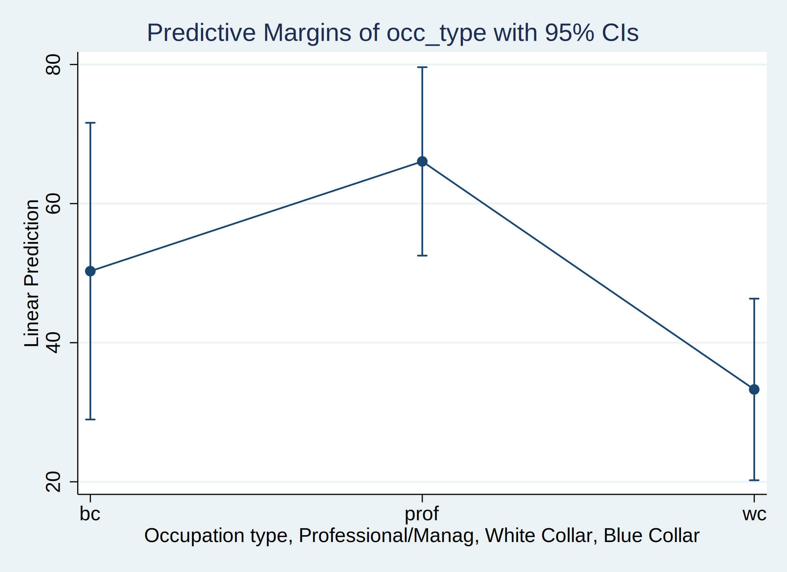
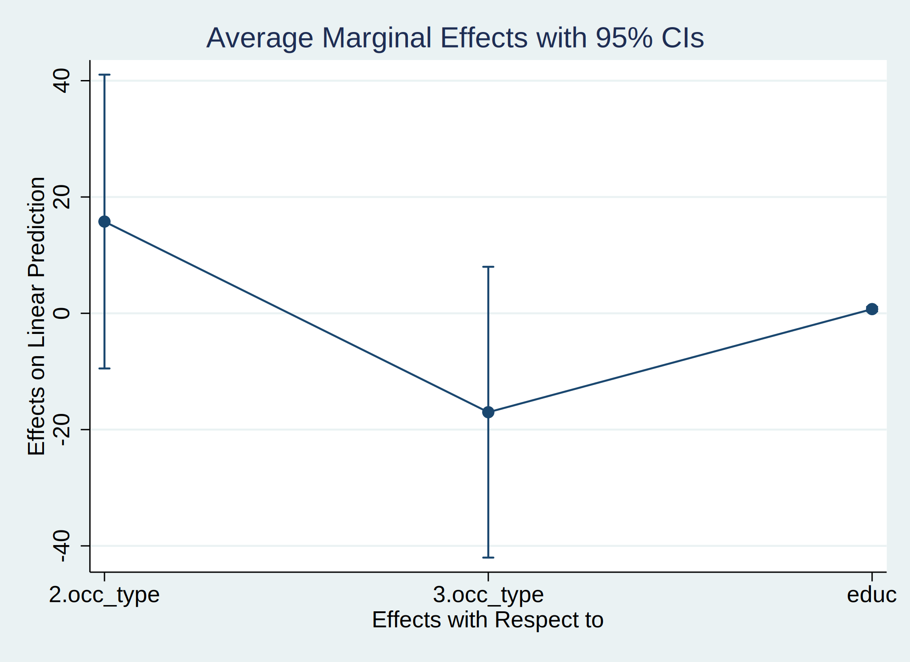

```{r setup, include=FALSE}
library(flexdashboard)
require(knitr)
knitr::opts_chunk$set(engine.path = list(
  stata = "/Applications/Stata/StataMP.app/Contents/MacOS/stata-mp"
))
```

Contents {data-navmenu="Introduction"}
=======================================================================

### Contents

This workshop covers steps for conducting statistical analyses in `R`
and preparing tables and figures.

* Presenting descriptive statistics & bivariate relationships
* Linear Regression
* Models for Categorical Outcome
* Models for Counts
* Coming soon...
    + Mixed Effects
    + Survival Analysis
    + requests?

It is assumed that you are familiar with `R` (e.g., you know about data types, 
data structures, and how to clean and create variables).  If this is not the 
case, you might want to check out the 
[Intro to R Workshop](https://www.asc.ohio-state.edu/thomas.3912/workshopMaterials/wsmaterials.html#introR)

Useful resources:

* [Dictionary: Stata to R](https://github.com/EconometricsBySimulation/RStata/wiki/Dictionary:-Stata-to-R)
* [R's `margins` vignette](https://www.rdocumentation.org/packages/margins/versions/0.3.23)
* [R's `dotwhisker` vignette](https://cran.r-project.org/web/packages/dotwhisker/vignettes/dotwhisker-vignette.html)

Setup {data-navmenu="Introduction"}
=======================================================================

We need a few R packages which can be installed with the following command:

```{r, echo=TRUE, eval=FALSE}
install.packages(c("haven", "stargazer", "margins", "prediction", "dotwhisker")
```

and the packages can be loaded with:

```{r, echo=TRUE}
library(haven)
library(stargazer)
library(prediction)
library(margins)
library(dotwhisker)
library(MASS)
library(nnet)
```


Table of Descriptives {data-navmenu="Descriptive Statistics"}
=======================================================================

### Table of descriptive statistics

Row {.tabset .tabset-fade data-height=3000}
-----------------------------------------------------------------------

### **Stata**
```{stata, eval=TRUE, comment = "", highlight=TRUE}
sysuse auto, clear
save auto.dta, replace
estpost summarize price mpg rep78 foreign, listwise
esttab, cells("mean sd min max")
```

### **R** 
```{r, echo=TRUE, eval=TRUE, results='asis'}
# load and summarize the data
autoData <- read_dta('auto.dta')
N <- nrow(autoData)
## summary(autoData)
stargazer(data.frame(autoData), type='html', out = "descriptives.html",
          summary.stat = c("mean", "sd", "min", "max"),
          notes = paste("Number of observations =", N))
# open the file descriptives.html, then copy and paste to excel
```

Linear Models {data-navmenu="Linear Regression"}
=======================================================================

### Introduction

Here we do the following with the prestige data

* **Contents**
    + linear regression with continuous and categorical predictors
    + creating tables with results from multiple models (with interactions and subsetting)
    + margins plots
* **Data**: prestige
    + unit of analysis: occupations
    + `prestige`: % of respondents who rated the occupation as "good" or "excellent"
    + `educ`: % of workers in the occupation who had a HS degree
    + `income`: % of workers in the occupation who earned more than $3,500
    + `occ_type`: indicator for type of occupation, with values blue collar (bc), professional and managerial (prof), and white collar (wc)


Fit linear model {data-navmenu="Linear Regression"}
=======================================================================

### Fit linear regression model

Row {.tabset .tabset-fade data-height=2000}
-----------------------------------------------------------------------

### **Stata**
```{stata, eval=TRUE, comment = "", highlight=TRUE}
* load and save the data
use https://stats.idre.ucla.edu/stat/stata/examples/ara/duncan, clear
save duncan.dta, replace

* summarize the data and fit a linear model
ds
regress prestige income educ i.occ_type
```

### **R** 
```{r, echo=TRUE, eval=TRUE}
# load and summarize the data
duncan <- read_dta('duncan.dta')
summary(duncan)
str(duncan$occ_type)
is.labelled(duncan$occ_type)
table(as_factor(duncan$occ_type), duncan$occ_type)

# fit the model and print the results
model1 <- lm(prestige ~ income + educ + factor(occ_type), data = duncan)
model1

# print even more results
summary(model1)
```

Accessing results {data-navmenu="Linear Regression"}
=======================================================================

### Accessing results

Row {.tabset .tabset-fade data-height=1500}
-----------------------------------------------------------------------

### **Stata**
```{stata}
use duncan, clear
quietly: regress prestige income educ i.occ_type

* display results
ereturn list
display e(r2)
matrix list e(b)
```


### **R** 
```{r, echo=TRUE, eval=TRUE}
names(model1)
names(summary(model1))
summary(model1)$r.squared
model1$coefficients
```

Multiple models {data-navmenu="Linear Regression"}
=======================================================================

### Multiple models

Row {.tabset .tabset-fade data-height=1500}
-----------------------------------------------------------------------

### **Stata**
```{stata}
use duncan, clear
quietly: regress prestige income
eststo mod1
quietly: regress prestige income educ
eststo mod2
quietly: regress prestige income educ i.occ_type
eststo mod3
quietly: regress prestige income educ i.occ_type c.income#c.educ
eststo mod4
estout mod1 mod2 mod3 mod4, cells(b(fmt(4) star) se(par)) stats(r2 N)
* syntax for writing results: using stataModels.csv
```


### **R**
```{r, echo=TRUE, eval=TRUE, results='asis'}
model1 <- lm(prestige ~ income, data = duncan)
model2 <- lm(prestige ~ income + educ, data = duncan)
model3 <- update(model2, . ~ . + as_factor(occ_type), data = duncan)
model4 <- lm(prestige ~ income*educ + as_factor(occ_type), data = duncan)
cov_labels <- c("Income", "Education", "Professional", "White Collar", 
                "Income * Education", "Intercept")
stargazer(model1, model2, model3, model4, type = "html", out = "models.html",
          model.numbers = FALSE, dep.var.caption = "", dep.var.labels.include = FALSE,
          column.labels = c("Model 1", "Model 2", "Model 3", "Model 4"),
          star.cutoffs = c(0.05, 0.01, 0.001),
          table.layout = "-c-!t-s-n",
          covariate.labels = cov_labels, digits = 4, keep.stat = c("rsq", "n"))
## open the file models.html, then copy and paste into MS Excel
## check out option: style (journal-specific format)
```

Subsetting {data-navmenu="Linear Regression"}
=======================================================================

### Subsetting

Row {.tabset .tabset-fade data-height=2000}
-----------------------------------------------------------------------

### **Stata**
```{stata}
use duncan, clear
codebook occ_type
regress prestige income educ if occ_type == 1
regress prestige income educ if occ_type == 2
regress prestige income educ if occ_type == 3
```


### **R**
```{r, echo=TRUE}
mod1_bc <- lm(prestige ~ income + educ, data = duncan, 
              subset = occ_type == 1)
mod1_prof <- lm(prestige ~ income + educ, data = duncan, 
                subset = occ_type == 2)
mod1_wc <- lm(prestige ~ income + educ, data = duncan, 
              subset = occ_type == 3)
summary(mod1_bc)
summary(mod1_prof)
summary(mod1_wc)
```


### **Stata** (another example)
```{stata}
use duncan, clear
regress prestige income educ if occ_type == 1 | occ_type == 3
```


### **R** (another example)
```{r, echo=TRUE}
duncan$occBCWC <- duncan$occ_type==1 | duncan$occ_type==3
table(duncan$occBCWC, duncan$occ_type)
mod1_bcwc <- lm(prestige ~ income + educ, data = duncan, 
              subset = occBCWC)
summary(mod1_bcwc)
```

Margins plots {data-navmenu="Linear Regression"}
=======================================================================

### Margins plots

Row {.tabset .tabset-fade data-height=3400}
-----------------------------------------------------------------------

### **Stata** (y-hat)
```{stata}
use duncan, clear
regress prestige occ_type##c.educ
margins occ_type
marginsplot
graph export "marginsPlot.svg", replace
``` 

<br/><br/>



### **R** (y-hat)
```{r, echo=TRUE, eval=TRUE}
duncan$occ_factor <- factor(duncan$occ_type, levels = 1:3, labels = c("bc", "prof", "wc"))
m1 <- lm(prestige ~ educ*occ_factor, data = duncan)
summary(m1)

p1 <- prediction(m1, at = list(occ_factor = c("bc", "prof", "wc")))
summary(p1)
yhat1 <- summary(p1)[, 1:5]
names(yhat1) <- c('term', 'estimate', 'std.error', 'statistic', 'p.value')
yhat1$term <- c('Blue Collar', 'Professional', 'White Collar')
dwplot(yhat1)

# Stata uses a t-distribution: qt(0.975, df = n - df)
cbind(yhat1[, 2] - qt(0.975, df = 39) * yhat1[, 3],
      yhat1[, 2] + qt(0.975, df = 39) * yhat1[, 3])

# we could code this up ourselves with the CIs based on t-dist...
```

### **Stata** (marginal effects)
```{stata}
use duncan, clear
regress prestige occ_type##c.educ
margins, dydx(*)
marginsplot
graph export "marginsPlotEffects.svg", replace
``` 

<br/><br/>



### **R** (marginal effects)
```{r, echo=TRUE, eval=TRUE}
m1 <- lm(prestige ~ educ*factor(occ_type), data = duncan)
marg1 <- margins(m1)
summary(marg1)
plot(marg1)

## use the following code to save the plot as a pdf file
## pdf('marg1_plot.pdf')
## plot(marg1)
## dev.off()

## alternative functions, to pdf(), include bmp(), jpeg(),
## png(), and tiff()
```

Logistic Regression {data-navmenu="Categorical Outcomes"}
=======================================================================

### Logistic Regression

Row {.tabset .tabset-fade data-height=3400}
-----------------------------------------------------------------------

### **Stata**
```{stata}
use https://stats.idre.ucla.edu/stat/stata/dae/binary.dta, clear
save gradSchool.dta, replace

su admit

logit admit gre gpa i.rank

``` 


### **R**
```{r, echo=TRUE, eval=TRUE}
gradSchool <- read_dta('gradSchool.dta')
logit1 <- glm(admit ~ gre + gpa + factor(rank), data = gradSchool,
              family = binomial(link = "logit"))
summary(logit1)
```

Probit Regression {data-navmenu="Categorical Outcomes"}
=======================================================================

### Probit Regression

Row {.tabset .tabset-fade data-height=3400}
-----------------------------------------------------------------------

### **Stata**
```{stata}
use gradSchool.dta, replace
probit admit gre gpa i.rank
``` 


### **R**
```{r, echo=TRUE, eval=TRUE}
gradSchool <- read_dta('gradSchool.dta')
probit1 <- glm(admit ~ gre + gpa + factor(rank), data = gradSchool,
              family = binomial(link = "probit"))
summary(probit1)

# change reference category
gradSchool$f_rank <- factor(gradSchool$rank)
gradSchool$f_rank <- relevel(gradSchool$f_rank, ref = "3")
probit2 <- glm(admit ~ gre + gpa + f_rank, data = gradSchool,
              family = binomial(link = "probit"))
summary(probit2)
```


Multinomial Regression {data-navmenu="Categorical Outcomes"}
=======================================================================

### Multinomial Regression

Row {.tabset .tabset-fade data-height=3400}
-----------------------------------------------------------------------

### **Stata**
```{stata}
use https://stats.idre.ucla.edu/stat/data/hsbdemo, clear
save hsbdemo, replace
mlogit prog i.ses write, base(2)
``` 


### **R**
```{r, echo=TRUE, eval=TRUE}
hsbdemo <- read_dta('hsbdemo.dta')
summary(hsbdemo)
hsbdemo$f_prog <- factor( hsbdemo$prog)
hsbdemo$f_prog <- relevel(hsbdemo$f_prog, ref = "2")
mnlog1 <- multinom(f_prog ~ factor(ses) + write, data = hsbdemo)
summary(mnlog1)
```

Poisson Regression {data-navmenu="Count Data"}
=======================================================================

### Poisson Regression

Row {.tabset .tabset-fade data-height=3400}
-----------------------------------------------------------------------

### **Stata**
```{stata}
use https://stats.idre.ucla.edu/stat/stata/dae/nb_data, clear
save schoolAbsence, replace
poisson daysabs math i.prog

``` 


### **R**
```{r, echo=TRUE, eval=TRUE}
schoolAbsence <- read_dta('schoolAbsence.dta')
pois1 <- glm(daysabs ~ math + factor(prog), data = schoolAbsence,
             family=poisson(link = "log"))
summary(pois1)
```

Negative Binomial Regression {data-navmenu="Count Data"}
=======================================================================

### Negative Binomial Regression

Row {.tabset .tabset-fade data-height=3400}
-----------------------------------------------------------------------

### **Stata**
```{stata}
use schoolAbsence, replace
nbreg daysabs math i.prog
``` 


### **R**
```{r, echo=TRUE, eval=TRUE}
schoolAbsence <- read_dta('schoolAbsence.dta')
nbreg1 <- glm.nb(daysabs ~ math + factor(prog), data = schoolAbsence)
summary(nbreg1)
# Stata parameterization is 1 / theta
```